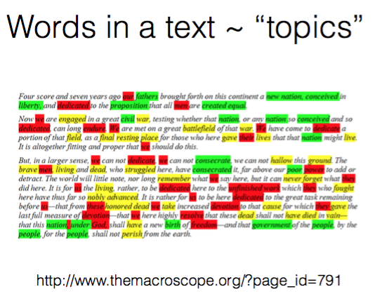
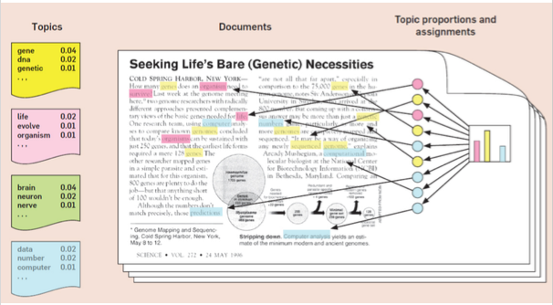
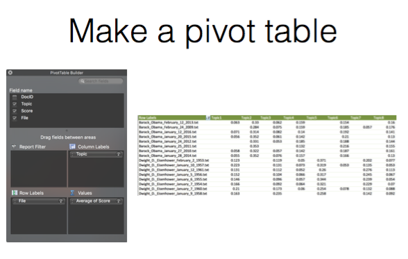
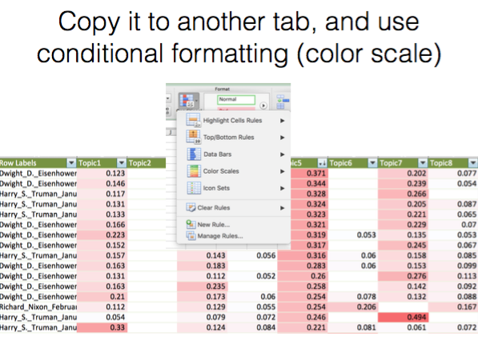
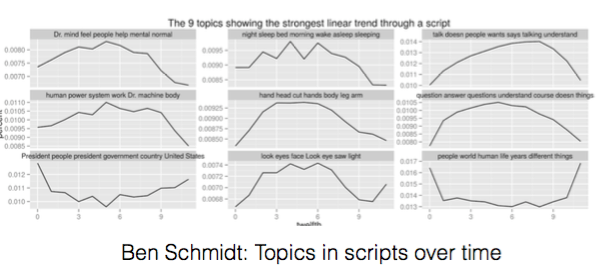
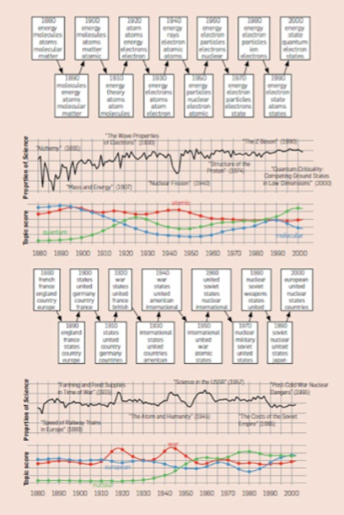

## Topic Modeling and Entity Recognition

Topics are described by words in a document.

From [David Blei article in CACM](https://cacm.acm.org/magazines/2012/4/147361-probabilistic-topic-models/fulltext):

Analyzing topic output in Excel:

Looking at topics over time:

From [Ben Schmidt analysis of scripts](http://sappingattention.blogspot.fr/2014/12/fundamental-plot-arcs-seen-through.html):

From [David Blei in CACM](https://cacm.acm.org/magazines/2012/4/147361-probabilistic-topic-models/fulltext):

## Final Projects Datasets

You must all analyse a different dataset.

Your options are:

* Twitter data (or Instagram data) that I have in a database for a particular search topic.
* Collect your own Twitter data.
* Screenplays by common writers or directors (I can help).
* Product reviews from Amazon (I can provide, some are in a database too).
* Make your own collection of books -- the same author, or same era / timeperiod, or some other theme.
* Yelp data on a single business (can't be one another used), this is also in a database.
* Other... you suggest. It has to be not tiny.

Post your choice on the Discussion Forum topic I will create.

The project requires 2 items:

A PDF summarizing your findings, using charts, data results, text extracts that illustrate what you found.  You should explain well, because you should assume your client does not know what these technical topics mean.

Notebook(s) with your analysis, which have comments in them for me to understand what you did.  (Use markdown.)

Points:

* 10 for following directions above.
* 20 for good PPT/PDF report that is clear and contains summary of your results, graphs/charts, text excerpts, wordclouds..
* 50 for use of techniques covered in class.  This means you did a lot of analysis types, tried a lot of things, applied what we learned.
* 10 Good code in your notebook. Good spacing, clean variable names, use of functions when appropriate, variables are used if introduced, etc.
* 10 Good comments in your notebook. This means using markdown, not just # comments.  Explain your process and results!

Due on March 6.

Twitter sources for Academic Data Analysis: https://gwu-libraries.github.io/sfm-ui/posts/2017-09-14-twitter-data
